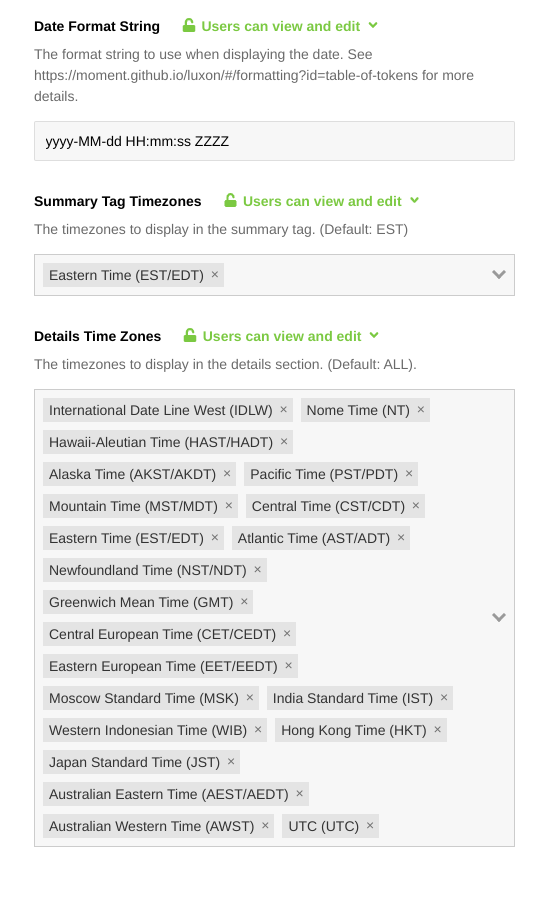
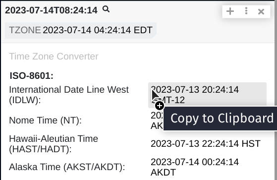

# Polarity Timezone Converter Integration

Polarity's Timezone Converter integration converts times from a number of common formats like ISO with Timezone, ISO-8601, Unix Timestamp, RFC-3339, Wayback Machine Memento Timestamp, & Nanoseconds Since Boot into a desired timezone and format.

|  | 
|---|
| _Timezone Integration_ | 
|  |
| _Timezone Options_ |
|  |
| _Timezone Types_ |
|  |
| _Copy Time in Details_ |

## Timezone Converter Integration Options
### Date Format String
The format string to use when displaying the date. The default is `yyyy-MM-dd HH:mm:ss ZZZZ`. See [Luxon Documentation](https://moment.github.io/luxon/#/formatting?id=table-of-tokens) for more details.

### Summary Tag Timezones
A multiselect option for picking which Timezone will be in the summary tags. By default `Eastern Standard Time (EST)`.

### Details Time Zones
A multiselect option for picking which Timezone will be in the summary tags. All available timezone are selected by default.

## Installation Instructions
Installation instructions for integrations are provided on the [PolarityIO GitHub Page](https://polarityio.github.io/).

## Polarity
Polarity is a memory-augmentation platform that improves and accelerates analyst decision making. For more information about the Polarity platform please see:

https://polarity.io/
